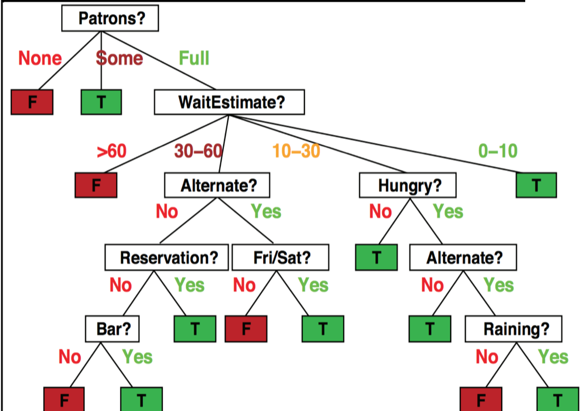
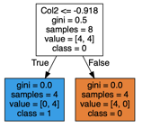

# CS 6601: Artificial Intelligence - Assignment 4 - Decision Trees and Forests

## Setup
Clone this repository:

`git clone https://github.gatech.edu/omscs6601/assignment_4.git`

For this assignment, you will need Numpy, No other external libraries are allowed for solving this problem.

Please use the same environment from previous assignments by running

```
conda activate ai_env
```

If you wish to run the supplementary testing notebook, you will need jupyter installed and can call the following command from your downloaded repository and select unit_testing:

```
jupyter notebook
```

If you wish to run the supplementary Helper notebook to visualize Decision tree, you will need to install graphviz library. Call the following command after your activate your conda environment:

```
pip install graphviz==0.13.0
```

Alternatively, you can simply run the below from your downloaded repository:

```
pip install -r requirements.txt
```

## Overview
Machine learning offers a number of methods for classifying data into discrete categories, such as k-means clustering. Decision trees provide a structure for such categorization, based on a series of decisions that led to separate distinct outcomes. In this assignment, you will work with decision trees to perform binary classification according to some decision boundary. Your challenge is to build and to train decision trees capable of solving useful classification problems. You will learn first how to build decision trees, then how to effectively train them and finally how to test their performance.

<p>



## Submission and Due Date

The deliverable for the assignment is a **_submission.py_** upload to Gradescope.

* All functions to be completed in **_submission.py_**

**Important**:
Submissions to Gradescope are rate limited for this assignment. **You can submit two submissions every 60 minutes during the duration of the assignment**.

In your Gradescope submission history, you can mark a certain submission as 'Active'. Please ensure this is your best submission.

### The Files

You will only have to edit and submit **_submission.py_**, but there are a number of notable other files:
1. **_submission.py_**: Where you will build your decision tree, confusion matrix, performance metrics, forests, and do the vectorization warm up.
2. **_decision_trees_submission_tests.py_**: Sample tests to validate your trees, learning, and vectorization locally.
3. **_unit_testing.ipynb_**: Helper Notebook to run through tests sequentially along with the readme

### Resources
* Canvas Udacity Videos: [Lesson 7, Machine Learning](https://gatech.instructure.com/courses/134646/pages/7-machine-learning?module_item_id=1089558)
* Textbook:<br> 
Chapter 18 Learning from Examples<br>
Chapter 20 Learning Probabilistic Models
* [Cross-validation](https://en.wikipedia.org/wiki/Cross-validation_(statistics))
* [K-Fold Cross-validation](http://statweb.stanford.edu/~tibs/sta306bfiles/cvwrong.pdf)

### Decision Tree Datasets
1. **_part23_data.csv_**: 4 features, 1372 data points, binary classification (last column)
2. **_challenge_train.csv_**:  30 features, 6636 datapoints, binary classification (first column)
3. **_challenge_test.csv_**: (will not be provided, but will be similarly structured as challenge_train with 40% of the datapoints)

#### Warmup Data
4. **_vectorize.csv_**: data used during the vectorization warmup for Assignment 4

### Imports
**NOTE:** We are only allowing three imports: numpy, collections.Counter and time. We will be checking to see if any other libraries are used. You are not allowed to use any outside libraries especially for part 4 (challenge). Please remember that you should not change any function headers.

---

### Part 0: Vectorization!
_[6 pts]_

* File to use: **_vectorize.csv_**

Vectorization is a process that provides enormous performance increases when processing large amounts of data. Whether one is training a deep neural network on millions of images, building random forests over a large dataset, or utilizing other algorithms, machine learning makes _extensive_ use of vectorization. In python, the **numpy** package provides a programmer with the ability to use python-wrapped, low-level optimizations written in C, however, the technique may feel strange at first and requires some practice to use comfortably.

The data management in Assignment 4 can benefit from familiarity with these techniques. Additionally, Assignment 4 has a vectorization requirement so that it can run within a reasonable time limit. This small section will hopefully introduce you to vectorization and some of the cool tricks you can use in python. We encourage you to use any numpy function out there (on good faith) to do the functions in the warmup section.

For the three functions that we have, we are testing your code based on how fast it runs. It will need to beat the non-vectorized code to get full points.

As a reminder, please don't ask the TA's for help regarding this section, we will not be able to assist you in any way. This section was created to help get you ready for the assignment; feel free to ask other students on Piazza or use the Internet.

How grading works:
1. We run the non-vectorized code and your vectorized code 500 times, as long as the average time of your vectorized code is less than the average time of the non-vectorized code, you will get the points (given that your answer is correct).

#### Functions to complete in the `Vectorization` class:
1. `vectorized_loops()`
2. `vectorized_slice()`
3. `vectorized_flatten()`


---


## The Assignment
Classification is used widely in machine learning to figure out how to sort new data that comes through.  You will build, train and test decision tree models to perform basic classification tasks. Students should understand how decision trees and random forests work. This will help you develop an intuition for how and why accuracy differs for training and testing data based on different parameters.

### Assignment Introduction
For this assignment we're going to need an explicit way to make structured decisions. The `DecisionNode` class will be used to represent a decision node as some atomic choice in a binary decision graph. We would only use this implementation of the Decision Tree for this assignment and any other implementations will be checked against and denied credit.

An object from the 'DecisionNode' can represent a class label (i.e. a final decision) or a binary decision to guide us through a flow-chart to arrive at a decision. Note that in this representation 'True' values for a decision take us to the left. This choice is arbitrary, but this is used in the hint below.

---

### Part 1a: Building a Binary Tree by Hand
_[5 Pts]_

In `build_decision_tree()`, construct a tree of decision nodes by hand in order to classify the data below, i.e. map each datum **x** to a label **y**.  Select tests to be as small as possible (in terms of attributes), breaking ties among tests with the same number of attributes by selecting the one that classifies the greatest number of examples correctly. If multiple tests have the same number of attributes and classify the same number of examples, then break the tie using attributes with lower index numbers (e.g. select **A1** over **A2**)
<p>

| Datum	| A1  | A2  | A3  | A4  |  y  |
| ----- | --- | --- | --- | --- | --- |
| x1    |  1  |  0  |  0  |  0  |  1  |
| x2    |  1  |  0  |  1  |  1  |  1  |
| x3    |  0  |  1  |  0  |  0  |  1  |
| x4    |  0  |  1  |  1  |  0  |  0  |
| x5    |  1  |  1  |  0  |  1  |  1  |
| x6    |  0  |  1  |  0  |  1  |  0  |
| x7    |  0  |  0  |  1  |  1  |  1  |
| x8    |  0  |  0  |  1  |  0  |  0  |

#### Requirements:
The tree nodes should be less than 10 nodes including the leaf (not the number of instances, but the actual nodes in the tree).

#### Hints:
To get started, it might help to **draw out the tree by hand** with each attribute representing a node.

To create the decision function that will be passed to `DecisionNode`, you can create a lambda expression as follows:

    func = lambda feature : feature[2] == 0

This will choose the left node if the third attribute is 0.

For example, a tree looks like this:

> if A1=0 then class = 1; else class = 0
> <p>
> 

You would write your code like this:

    decision_tree_root = DecisionNode(None, None, lambda a: a[1] == 0)
    decision_tree_root.left = DecisionNode(None, None, None, 1)
    decision_tree_root.right = DecisionNode(None, None, None, 0)

    return decision_tree_root

#### Functions to complete in the `submission` module:
1. `build_decision_tree()`

---

### Part 1b: Precision, Recall, Accuracy and Confusion Matrix
_[12 pts]_

Now that we have a decision tree, we're going to need some way to evaluate its performance. In most cases we would reserve a portion of the training data for evaluation, or use cross-validation. Fill out the methods to compute the confusion matrix, accuracy, precision and recall for your classifier output. `classifier_output` is just the list of labels that your classifier outputs, corresponding to the same examples as `true_labels`. You can refer to [Wikipedia](https://en.wikipedia.org/wiki/Confusion_matrix) for calculating the true/false positive/negative.

If you want to calculate the example set above by hand, run the following code.

    classifier_output = [decision_tree_root.decide(example) for example in examples]

    p1_confusion_matrix = confusion_matrix(classifier_output, classes)
    p1_accuracy = accuracy( classifier_output, classes )
    p1_precision = precision(classifier_output, classes)
    p1_recall = recall(classifier_output, classes)

    print p1_confusion_matrix, p1_accuracy, p1_precision, p1_recall

#### Functions to complete in the `submission` module:
1. `confusion_matrix()`
2. `precision()`
3. `recall()`
4. `accuracy()`

---

### Part 2a: Decision Tree Learning
_[6 pts]_

The first step in order to learn how best to create a decision tree, we need to know how well we are splitting the data. This is usually done by measuring the entropy of each split and using it to calculate information gain, but we'd like you to use GINI impurity instead of entropy for this assignment. We can do this by calculating the  `gini_impurity` and `gini_gain()` on the various splits (hints: [gini impurity](https://en.wikipedia.org/wiki/Decision_tree_learning#Gini_impurity) and [information gain](https://en.wikipedia.org/wiki/Information_gain_in_decision_trees)). The Gini Gain follows a similar approach to information gain, replacing entropy with Gini Impurity.

<p>

#### Functions to complete in the `submission` module:
1. `gini_impurity()`
2. `gini_gain()`

---

### Part 2b: Decision Tree Learning
_[20 pts]_

* File to use: **_part23_data.csv_**
* Grading: average test accuracy over 10 rounds should be >= 70%

As the size of our training set grows, it rapidly becomes impractical to build these trees by hand. We need a procedure to automagically construct these trees.

For starters, let's consider the following algorithm (a variation of [C4.5](https://en.wikipedia.org/wiki/C4.5_algorithm)) for the construction of a decision tree from a given set of examples:
1. Check for base cases:
   1. If all elements of a list are of the same class, return a leaf node with the appropriate class label.
   2. If a specified depth limit is reached, return a leaf labeled with the most frequent class.
2. For each attribute alpha: evaluate the normalized gini gain gained by splitting on attribute `alpha`.
3. Let `alpha_best` be the attribute with the highest normalized gini gain.
4. Create a decision node that splits on `alpha_best`.
5. Repeat on the sublists obtained by splitting on `alpha_best`, and add those nodes as children of this node

First, in the `DecisionTree.__build_tree__()` method implement the above algorithm.
Next, in `DecisionTree.classify()`, write a function to produce classifications for a list of features once your decision tree has been built.

Some other helpful notes:
1. Your features and classify should be in numpy arrays where if the dataset is (_m_ x _n_) then the features is (_m_ x _n_-1) and classify is (_m_ x _1_)
2. These features are continuous features and you will need to split based on a threshold. Consider different options for what this threshold might be.

How grading works:
1. We load **_part23_data.csv_** and create our cross-validation training and test set with a `k=10` folds.  We use our own `generate_k_folds()` method.
2. We fit the (folded) training data onto the tree then classify the (folded) testing data with the tree.
3. We check the accuracy of your results versus the true results and we return the average of this over k=10 iterations.

#### Functions to complete in the `DecisionTree` class:
1. `__build_tree__()`
2. `classify()`

---

### Part 2c: Validation
_[10 pts]_

* File to use: **_part23_data.csv_**
* Grading: average test accuracy over 10 rounds should be >= 70%

In general, reserving part of your data as a test set can lead to unpredictable performance. A serendipitous choice of your training or test split could give you a very inaccurate idea of how your classifier performs. We can overcome this limitation by using k-fold cross validation.

In `generate_k_folds()`, we'll split the dataset at random into k equal subsections. Then iterating on each of our k samples, we'll reserve that sample for testing and use the other k-1 for training. Averaging the results of each fold should give us a more consistent idea of how the classifier is doing across the data as a whole.
For those who are not familiar with k folds cross-validation, please refer the tutorial here: [A Gentle Introduction to k-fold Cross-Validation](https://machinelearningmastery.com/k-fold-cross-validation/).

How grading works:
1. The same as 2b however, we use your `generate_k_folds()` instead of ours.

#### Functions to complete in the `submission` module:
1. `generate_k_folds()`

---

### Part 3: Random Forests
_[30 pts]_

* File to use: **_part23_data.csv_**
* Grading: average test accuracy over 10 rounds should be >= 75%

The decision boundaries drawn by decision trees are very sharp, and fitting a decision tree of unbounded depth to a list of training examples almost inevitably leads to overfitting. In an attempt to decrease the variance of our classifier we're going to use a technique called 'Bootstrap Aggregating' (often abbreviated as 'bagging').

A Random Forest is a collection of decision trees, built as follows:
1. For every tree we're going to build:
   1. Subsample the examples provided us (with replacement) in accordance with a provided example subsampling rate.
   2. From the sample in the first step, choose attributes at random to learn on (in accordance with a provided attribute subsampling rate). (Without replacement)
   3. Fit a decision tree to the subsample of data we've chosen (to a certain depth).

Classification for a random forest is then done by taking a majority vote of the classifications yielded by each tree in the forest after it classifies an example.

Fill in `RandomForest.fit()` to fit the decision tree as we describe above, and fill in `RandomForest.classify()` to classify a given list of examples.

Your features and classify should be in numpy arrays where if the dataset is (_m_ x _n_) then the features is (_m_ x _n_-1) and classify is (_n_ x _1_).

To test, we will be using a forest with 5 trees, with a depth limit of 5, example subsample rate of 0.5 and attribute subsample rate of 0.5

How grading works:
1. Similar to 2b but with the call to Random Forest.

#### Functions to complete in the `RandomForest` class:
1. `fit()`
2. `classify()`

---

### Part 4: Challenge Classifier
_[10 pts]_

* File to use: **_challenge_train.csv_**
* Grading: average training accuracy over 10 runs should be >= 80% and average testing accuracy over 10 runs should be >= 70%

The Challenge Classifier should be implemented using some sort of a **tree structure**.  Students in the past have been able to call their `RandomForest` with different parameters. We also encourage things like boosting.

You've been provided with a sample of data from a research dataset in **_challenge_train.csv_** while we have reserved a part of the dataset for testing called **_challenge_test.csv_** (which you do not have access to).

To get full points for this part of the assignment, you'll need to get at least an average accuracy of 80% on the training data you have (**_challenge_train.csv_**), and at least an average accuracy of 70% on the holdout/test set (**_challenge_test.csv_**).

#### Functions to complete in the `ChallengeClassifier` class:
1. `__init__()`
2. `fit()`
3. `classify()`

---
### Part 5: Return Your name!
_[1 pts]_
Return your name from the function `return_your_name()`

---

### Helper Notebook

#### Note: You do not need to implement anything in this notebook. This part is not graded, so you can skip this part if you wish to. This notebook is just for your understanding purpose. It will help you visualize Decision trees on the dataset provided to you.
The notebook Visualize_tree.iypnb can be use to visualize tree on the datasets. You can play with this playbook. Things you can Observe:
1. How the values are splitted?
2. What is the ginni value at leaf nodes?
3. What does internal nodes represents in this DT?
4. Why all leaf nodes are not at same depth?

Feel free to change and experiment with this notebook. you can look and use Information gain as well instead of ginni to see how the DT built based on that.

### Bonus

**Note:** This part will be ever changing. Official announcements for this bonus will be made through Piazza.

We will be having a competition using your challenge classifier and a dataset of our choice. We will provide you with a portion of the dataset as well as the testing data (but without the labels) and you will upload your solution as a csv to Kaggle. Kaggle will evaluate your scores and the classifier with the highest score will win the competition. Any ties will be broken by the submission time.

We are still figuring out all the details for this bonus. Expect the competition to be open for at least a week after the assignment ends.

##### Bonus Points Metric
All bonus points will be added to your assignment 4 grades.

1. First place:  15 bonus points
2. Second place:    12 bonus points
3. Third place:     10 bonus points
4. Everyone else who achieves an accuracy of more than a
   threshold to be determined when the challenge is finalized: 7 bonus points
